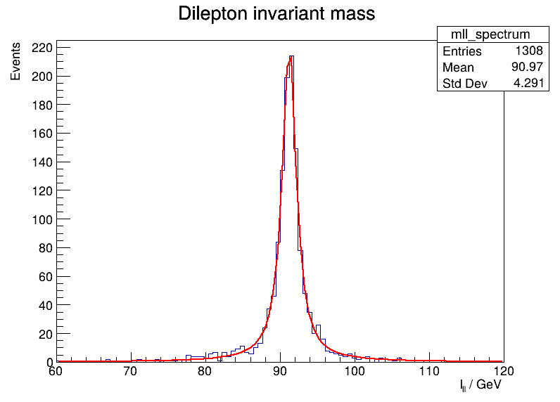

# ISSEP Dilepton Project

We have a simulation data from a $p + p$ collider.
We are going to analyze dilepton events in order to show how one could rediscover the Z boson, since it has a high branching ratio to decay into a lepton-antilepton pair.

$$
Z \rightarrow l + \bar{l}
$$

We are going to filter out events where we have a dilepton pair.
This occurs when the two leptons have the same mass $m_{l} = m_{\bar{l}}$ and opposite charge $q_{l} = -q_{\bar{l}}$.
After that we are going to calculate the dilepton 4-momentum which is the same as the sum of their 4-momenta.
Since 4-momentum is conserved due to relativity we can say that if the pair was produced by an unknown particle, its 4-momentum is going to equal that of the dilepton.
In order to identify this possible unknown particle we will use the spectrum of the dilepton mass.

$$
p_{Z} = p_{l} + p_{\bar{l}}
$$

The spectrum should be a Breit-Wigner distribution from a theoretical standpoint.
So we are going to fit the result and extract the mass and decay width of the resonance which will be enough to prove the observation of the Z boson in the toy data.

$$
\left|\frac{i}{p^2 - m^2 + im\Gamma}\right|^2
$$

The results from the given data is a Z boson with the following mass and decay width:

$$
\begin{aligned}
m_Z      &= 91.26 \pm 0.07 \mathrm{GeV} \\
\Gamma_Z &= 2.61 \pm 0.10 \mathrm{GeV}
\end{aligned}
$$



## `dilepton.py`

Use the `--help` flag to check the inline arguments.

```shell
python dilepton.py --help
```

## Misc

All `.root` data is in `data/` directory which is ignored in `git`.
